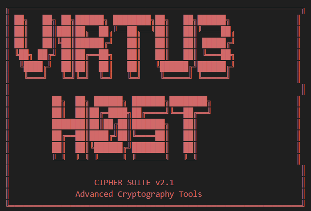

# 🔐 Cipher Suite v2.1


A collection of cryptographic tools written in Python, featuring an **elite Caesar Cipher engine** with brute force cracking and frequency analysis.



---

## 🚀 Features

- **Caesar Cipher Engine**  
  Encrypt and decrypt messages with customizable shift values.

- **Ghost Crack Mode**  
  Brute force all 26 possible shifts to reveal hidden messages.

- **Pattern Scan (Frequency Analysis)**  
  Analyze text and display the most common letters with percentages.

- **Case Preservation**  
  Keeps uppercase and lowercase letters intact during encryption/decryption.

- **ASCII Banner**  
  Stylish terminal intro for a professional look.

  !(screenshots/vh1.png)

---

## 📂 Project Structure

- **`Cipher.py`** → Main Caesar Cipher engine (PhantomCipher class)  
- **`code_explained.txt`** → Beginner-friendly explanation of how the cipher works

---

## 🛠️ Usage

Clone the repository:

```bash
git clone https://github.com/v1Rtu3-h05t/Cipher-Suite.git
cd Cipher-Suite
python Cipher.py
```

```AVAILABLE COMMANDS:
  [1] Encrypt text
  [2] Decrypt text
  [3] Ghost crack (brute force all shifts)
  [4] Pattern scan (frequency analysis)
  [5] Exit terminal
```

## 🧠 Example
```Encrypting with a shift of 3:
Message: HELLO WORLD
Shift: 3
Result: KHOOR ZRUOG
Decrypting with the same shift:
Message: KHOOR ZRUOG
Shift: 3
Result: HELLO WORLD
```

## 📊 Frequency Analysis Example
```[*] PATTERN SCAN RESULTS - Top 5 characters:
   E:  12 hits (12.7%)
   T:   9 hits (9.5%)
   A:   8 hits (8.4%)
   O:   7 hits (7.3%)
   N:   6 hits (6.3%)
[i] Intel: 'E' frequency in English ~= 12.7%
```

## ⚡ Future Plans
Add support for other classical ciphers (Vigenère, Atbash, ROT13)

Build a web interface with Flask/Streamlit

Expand brute force cracking with dictionary checks

Add color/glitch animation to the ASCII banner
